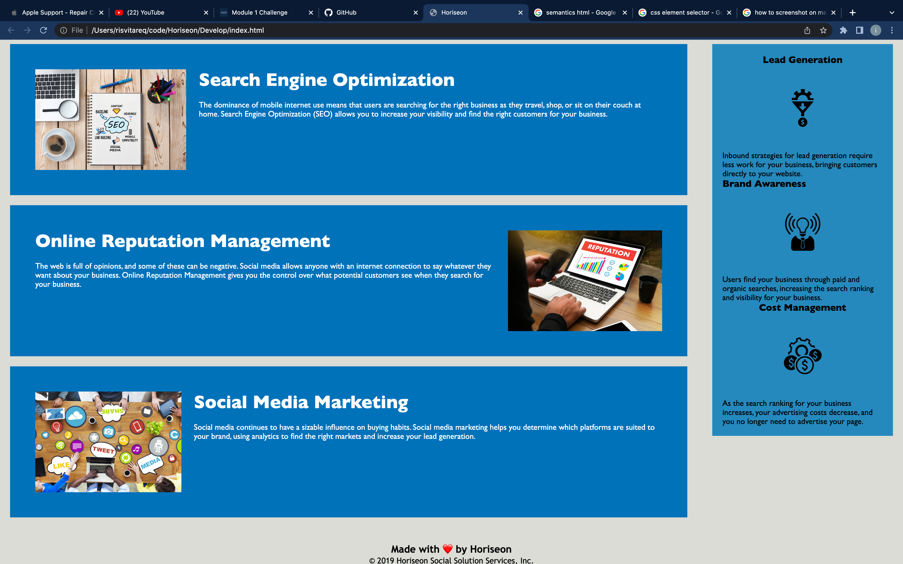

# Horiseon

In this Homework, you will modify the HTML document to be semantically correct. You want to ensure that the HTML information is easily accessible. Anyone who opens the HTML file will understand what they are looking at.

## Instructions

* AS A marketing agency,
I want a codebase that follows accessibility standards
SO THAT our own site is optimized for search engines.

## Acceptance Criteria

* It's done when I view the source code, then I find semantic HTML elements.

* It's done when I view the structure of the HTML elements, then I find that the elements follow a logical structure independent of styling and positioning.

* It's done when I view the image elements, then I find accessible alt attributes.

* It's done when I view the heading attributes, then they fall in sequential order.

* It's done when I view the title element, then I find a concise, descriptive title.

## What I did to the HTML file
I changed all the div elements to more semantically correct elements. I commented which ones I had changed and why I had changed them. 
* I changed the first semantic element from div to header, because its' contents are at the top of the webpage. 
* I changed the second element to nav, because the contents resemble a navigational bar.
* I changed the third div element to figure, because it contained an image.
* I changed the fourth div element to main, because it contains various subsections, has most of the general information and is located beneath the header.
* I changed the fifth, sixth and seventh div elements to section, because they were children of the main element.
* I changed the eigth div element to aside, because all of its contents are located on the side of the page.
* I changed ninth, tenth and eleventh elements under the aside to section, because they are nested within the aside.
* I changed the twelvth div element to footer, because it contained the contents at the bottom of the page.

## What I did to the CSS file
* I changed the elements that contained the div element to nav, because of the changes I had made on the HTML document.
* I had grouped redundant code in the CSS file and commented out the unnecessary code and consolidated the selectors that contained the exact same selectors.

## Screenshots of the Horiseon page

